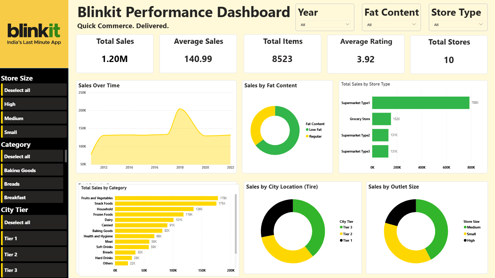

# 🛒 Blinkit Grocery Sales Dashboard

> **Power BI Data Analytics Project | Created by Mayur Mandavkar**

## 📊 Project Overview

The **BlinkIT Grocery Sales Dashboard** is an interactive Power BI project created to analyze grocery sales data and convert raw business data into meaningful insights.

The dashboard provides a clear view of sales performance across **product categories, store types, city tiers, store sizes, fat content, store-opening years, and customer ratings**. It allows users to interact with the data through filters and quickly identify important business trends.

This project demonstrates practical skills in **data cleaning, Power Query, DAX, data analysis, visualization, and Power BI dashboard development**.

## 📷 Dashboard Preview



## 🎯 Project Objectives

The main objectives of this project are to:

- Analyze overall grocery sales performance.
- Identify the highest-performing product categories.
- Compare sales across different store types.
- Analyze sales by city tier and store size.
- Compare sales based on product fat content.
- Analyze sales according to store-opening year.
- Monitor average customer ratings.
- Create an interactive dashboard for business analysis.
- Generate useful insights that can support business decisions.

## 🛠️ Tools & Technologies

| Tool | Purpose |
|---|---|
| **Microsoft Excel** | Source dataset |
| **Power BI Desktop** | Dashboard development and analysis |
| **Power Query** | Data cleaning and transformation |
| **DAX** | KPI calculations and measures |
| **Power BI Visuals** | Interactive data visualization |

## 📁 Dataset Overview

The dataset contains **8,523 records and 12 columns** covering grocery products, stores, sales, and customer ratings.

| Metric | Value |
|---|---:|
| Total Records | 8,523 |
| Total Columns | 12 |
| Unique Products | 1,559 |
| Unique Stores | 10 |
| Product Categories | 16 |
| Store Opening Years | 2011–2022 |
| Total Sales | 1,201,681.49 |
| Average Sales | 140.99 |
| Average Customer Rating | 3.97 |

The main fields include **Fat Content, Product ID, Category, Store Opened (Year), Store ID, City Tier, Store Size, Store Type, Shelf Visibility, Weight, Sales, and Customer Rating**.

## 🧹 Data Cleaning & Transformation

The raw Excel dataset was prepared using **Power Query in Power BI**.

The main data preparation steps included:

1. Importing the Excel dataset into Power BI.
2. Standardizing column names.
3. Correcting inconsistent values.
4. Assigning appropriate data types.
5. Checking missing values and data quality.
6. Validating categories, identifiers, sales values, and ratings.
7. Loading the cleaned data into Power BI.

One example of data cleaning was correcting the inconsistent **“Regularular”** value to **“Regular”** in the Fat Content field.


## 🧮 DAX Measures

Several DAX measures were created for the dashboard KPIs.

### Total Sales

```DAX
Total Sales = SUM('BlinkIT Grocery Data'[Sales])
```

### Average Sales

```DAX
Average Sales = AVERAGE('BlinkIT Grocery Data'[Sales])
```

### Total Items

```DAX
Total Items = COUNTROWS('BlinkIT Grocery Data')
```

### Total Stores

```DAX
Total Stores = DISTINCTCOUNT('BlinkIT Grocery Data'[Store ID])
```

### Average Rating

```DAX
Average Rating = AVERAGE('BlinkIT Grocery Data'[Customer Rating])
```

### Total Products

```DAX
Total Products = DISTINCTCOUNT('BlinkIT Grocery Data'[Product ID])
```

These measures were used to calculate the main business KPIs and support interactive analysis.

## 📊 Dashboard Features

The dashboard was designed as a **single-page interactive Power BI report**.

### KPI Cards

The dashboard displays important metrics such as:

- **Total Sales**
- **Average Sales**
- **Total Items**
- **Average Rating**
- **Total Stores**

### Visualizations

The dashboard includes:

- 📈 **Sales Over Time** – Line Chart
- 🥑 **Sales by Fat Content** – Donut Chart
- 🏪 **Sales by Store Type** – Bar Chart
- 🌆 **Sales by City Tier** – Donut Chart
- 🛒 **Sales by Category** – Bar Chart
- 🏬 **Sales by Store Size** – Donut Chart

## 🎛️ Interactive Filters

The dashboard includes slicers for:

- **Store Opened (Year)**
- **Fat Content**
- **Store Type**
- **Store Size**
- **Category**
- **City Tier**

When a user selects a filter, the KPI cards and charts update according to the selected context, allowing users to perform interactive exploratory analysis.

## 💡 Key Business Insights

Based on the supplied dataset:

- **Total Sales:** approximately **1,201,681.49**
- **Highest Sales Category:** Fruits and Vegetables
- **Highest Sales Store Type:** Supermarket Type1
- **Highest Sales City Tier:** Tier 3
- **Highest Sales Store Size:** Medium
- **Average Customer Rating:** approximately **3.97/5**

These insights can be further explored using the dashboard's interactive filters.

## 📌 Business Applications

The dashboard can help with:

- Identifying high-performing product categories.
- Comparing different store formats.
- Understanding city-tier performance.
- Comparing store sizes.
- Analyzing product preferences by fat content.
- Monitoring sales across store-opening years.
- Supporting inventory and marketing decisions.
- Identifying areas requiring further investigation.

The dashboard is designed as an **analytical decision-support tool** rather than a replacement for detailed operational or financial reporting.

## 📈 Project Workflow

```text
Raw Excel Data
      ↓
Data Import
      ↓
Power Query
      ↓
Data Cleaning
      ↓
Data Transformation
      ↓
DAX Measures
      ↓
Data Visualization
      ↓
Dashboard Design
      ↓
Interactive Analysis
      ↓
Business Insights
```

## 🎓 Skills Demonstrated

### Data Analytics
- Data Cleaning
- Data Exploration
- Data Validation
- Business Analysis
- Insight Generation

### Power BI
- Power Query
- Data Transformation
- DAX
- KPI Development
- Data Visualization
- Slicers
- Interactive Dashboard Design

### Business Intelligence
- KPI Analysis
- Trend Analysis
- Category Analysis
- Store Performance Analysis
- Geographic Analysis
- Decision-Support Reporting

## 📂 Project Structure

```text
Blinkit-Grocery-Sales-Dashboard/
│
├── BlinkIT Grocery Data.xlsx
├── Blinkit.pbix
├── dashboard.png
└── README.md
```

## ⭐ Conclusion

The **BlinkIT Grocery Sales Dashboard** demonstrates the complete Power BI workflow, from importing and cleaning an Excel dataset to creating DAX measures, interactive visualizations, filters, and business insights.

The final dashboard provides a concise view of sales performance across **products, categories, stores, city tiers, store sizes, fat content, and store-opening years**.

Overall, this project demonstrates how **Power BI can transform raw data into an interactive business intelligence solution and actionable insights**.
